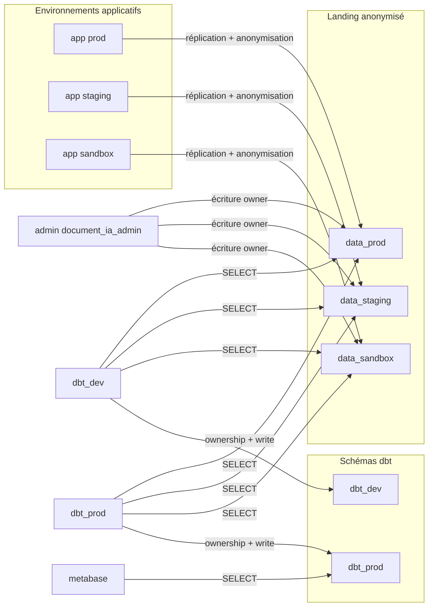

# document-ia-data

Models de transformation de données pour Document-IA.

Projet [dbt Core](https://docs.getdbt.com/) avec l'adaptateur PostgreSQL, exécuté contre l'add-on PostgreSQL de l'application.

## Prérequis

- Python 3.10 ou plus
- Docker (pour la base PostgreSQL locale)

## Installation

```bash
make install          # virtualenv .venv + dépendances + packages dbt
cp .env.example .env  # variables de connexion (chargées automatiquement par dbt)
source .venv/bin/activate
```

## Développement en local

```bash
make db-up            # PostgreSQL local sur le port 5432
dbt debug             # vérifie la configuration et la connexion
dbt build             # seeds, modèles, snapshots et tests
dbt docs generate && dbt docs serve
```

## Exécution sur l'add-on PostgreSQL

Les identifiants ne sont jamais versionnés : `profiles.yml` lit uniquement des variables
d'environnement. Cible `dev` → schéma `dbt_dev` ; cible `prod` → schéma `dbt_prod`
(avec `sslmode=require` et aucune valeur par défaut sur l'hôte / le mot de passe).

```bash
# Exemple : construire avec le rôle dbt_prod contre l'add-on
DBT_TARGET=prod \
DBT_HOST=... DBT_PORT=... DBT_DBNAME=... \
DBT_USER=dbt_prod DBT_PASSWORD=... \
dbt build
```

## Permissions base de données

Les schémas et grants de l'add-on Scalingo sont posés par des scripts SQL versionnés
dans [`scripts/sql/`](scripts/sql/) :



| Utilisateur | Étape | Droits |
| --- | --- | --- |
| `document_ia_admin` (admin) | Réplication / anonymisation | Owner et écriture sur `data_*` ; ownership de `public` (config Metabase) |
| `dbt_dev` | Transformation (env de développement) | SELECT sur les 3 `data_*` ; ownership complet de `dbt_dev` |
| `dbt_prod` | Transformation (env de production) | SELECT sur les 3 `data_*` ; ownership complet de `dbt_prod` |
| `metabase` | Analytics | SELECT sur `dbt_prod` uniquement (y compris tables recréées par `dbt build`) |

À appliquer une fois, dans l'ordre, avec trois connexions distinctes. Détail et
vérifications : [scripts/sql/README.md](scripts/sql/README.md).

## Structure

| Chemin                | Contenu                                                            |
| --------------------- | ------------------------------------------------------------------ |
| `dbt_project.yml`     | Configuration du projet et des couches de modèles                  |
| `profiles.yml`        | Connexions `dev` (`dbt_dev`) et `prod` (`dbt_prod`), pilotées par l'environnement |
| `packages.yml`        | Packages dbt (`dbt_utils`)                                         |
| `models/`             | Modèles, organisés en `staging` / `core` / `analytics` (voir [models/README.md](models/README.md)) |
| `macros/`             | Macros Jinja réutilisables                                         |
| `seeds/`              | Données de référence versionnées en CSV                            |
| `snapshots/`          | Historisation des tables sources                                   |
| `tests/`              | Tests SQL sur mesure                                               |
| `analyses/`           | Requêtes exploratoires, compilées mais non matérialisées           |
| `scripts/sql/`        | Scripts de permissions Postgres (schémas, grants, default privileges) |

Les modèles sont matérialisés dans le schéma `DBT_SCHEMA` (`dbt_dev` en cible `dev`,
`dbt_prod` en cible `prod`). Les sources staging viseront les trois schémas landing
`data_prod` / `data_staging` / `data_sandbox`.

## Intégration continue

Le workflow [`.github/workflows/ci.yml`](.github/workflows/ci.yml) exécute `dbt deps`,
`dbt debug` puis `dbt build` sur chaque pull request, contre un service PostgreSQL éphémère.
